# ✉️ MailCraft — Multi-Channel Email Studio & Visual Template Engine

**A responsive, production-ready visual email layout workbench and canvas.**

MailCraft is a premium, unified content workspace built for digital creators and engineering teams. It allows designers to describe template structures, custom color palettes, and marketing copy **once** in a single structured JSON object, instantly generating responsive, standards-compliant assets across multiple views: **Email Clients Layouts**, **Responsive Web Pages**, and **Print-Ready Documents**.

### 🌓 Dark Mode Hero
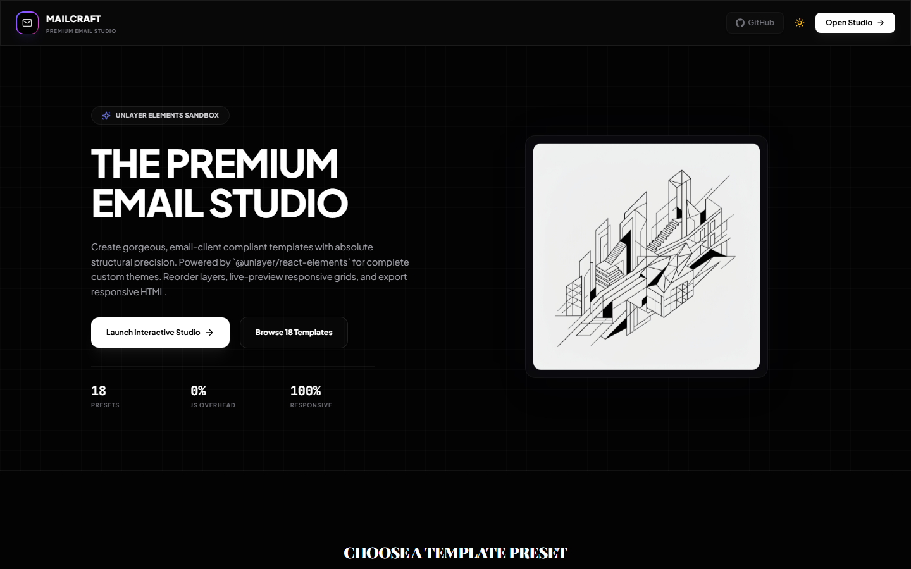

### 🌓 Light Mode Hero
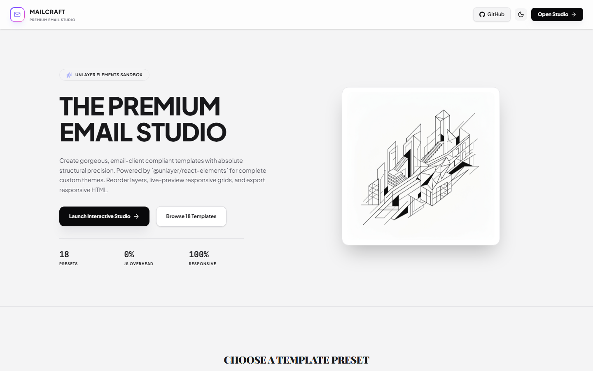

---

## 📌 Problem Statement

Digital marketing and engineering teams face significant friction maintaining consistency and quality across multiple marketing channels:
1. **Fragmented Email Client Styling:** Writing standards-compliant email code is notoriously difficult. Ensuring layouts render consistently across Outlook, Gmail, Apple Mail, and mobile clients requires verbose, nested table code and inline CSS.
2. **Design-to-Code Drift:** Building email templates in isolated visual designers and then manually coding them leads to design inconsistencies, structural bugs, and lost productivity.
3. **Double Maintenance:** Updating a promotion code, changing product pricing, or tweaking color variables requires editing code configurations in several separate files, leading to high operational overhead.

---

## 💡 The Solution: MailCraft

MailCraft addresses these challenges using the philosophy of **"One source of truth → Multiple responsive outputs."** Powered by `@unlayer/react-elements` compatible blocks, the studio reads a single data schema and renders branded outputs across three media viewports:

1. 📧 **Compliant Email Newsletter:** A responsive, single-column table layout optimized for standard email clients, containing brand headers, feature logs, spotlights, and feedback grids.
2. 📱 **Mobile & Desktop Web Page:** A responsive web document view that renders the template using responsive web elements, standard typography spacing, and modern styling tokens.
3. 📄 **Print Documents & PDFs:** A print-formatted document engine that wraps content according to A4 portrait specs, with custom margins and typography styles suitable for offline publication.

### 🎨 Visual Theme Presets Catalog
Designers can instantly swap the branding aesthetic using curated presets. The studio dynamically translates typography families, color variables, borders, button configurations, and shadow depths across all formats.

#### Dark Mode presets


#### Light Mode presets
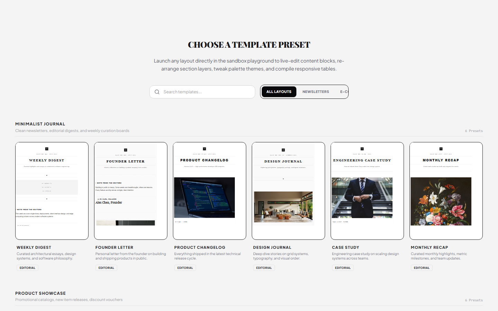

### 🗂️ Rich Template Presets (18 Layouts)
While MailCraft provides a catalog of **18 professional templates** spanning Newsletter digests, E-commerce showcases, and Event launches, here are screenshots of 5 selected templates live-rendered by our rendering compiler:

| **Weekly Digest (Editorial)** | **Founder Letter (Editorial)** |
| :---: | :---: |
| 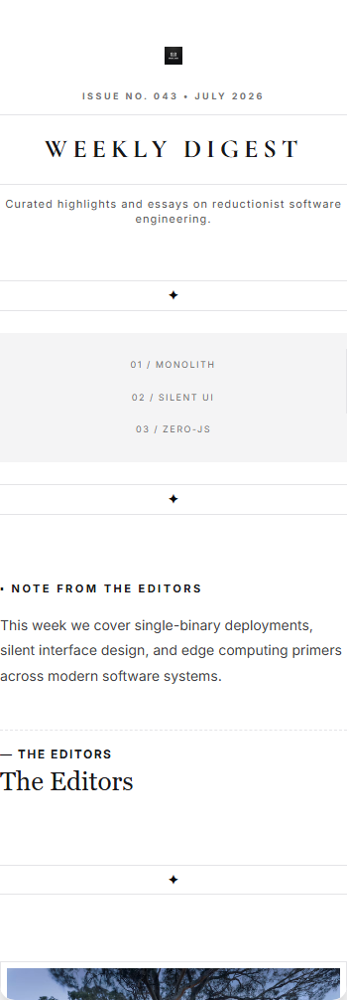 | 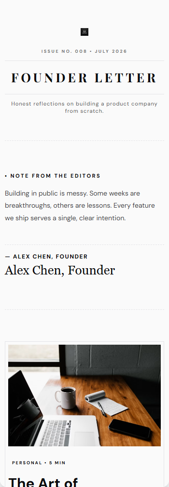 |

| **New Collection (Commerce)** | **Flash Sale (Commerce)** |
| :---: | :---: |
| 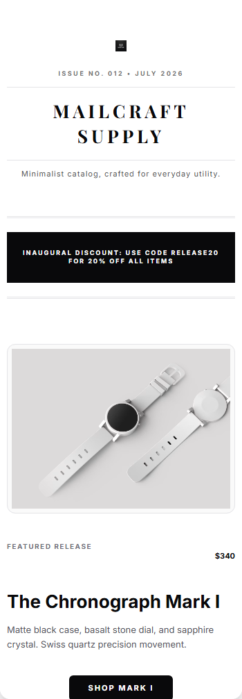 | 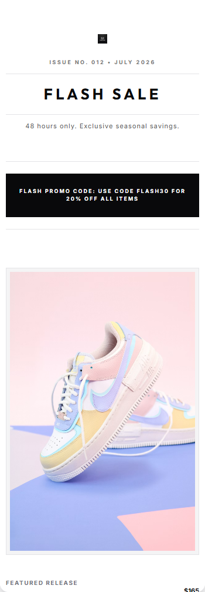 |

| **Product Launch (Event)** |
| :---: |
| 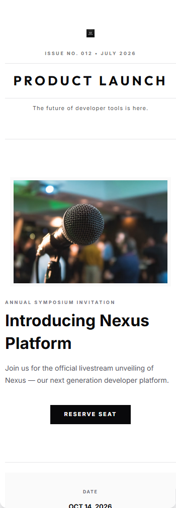 |

---

## 🛠️ Multi-Channel Workspace Features

Every template compiles in real time. The workspace provides complete control over the layout, theme variables, and layout items:

### 💻 Split View Workspace Layout
A split-screen workspace featuring the real-time **Sidebar Customizer** panel on the left and a live-updating **Format Preview Viewport** showing output channels simultaneously. Includes responsive mobile, tablet, and desktop simulations.

#### Dark Mode Workspace
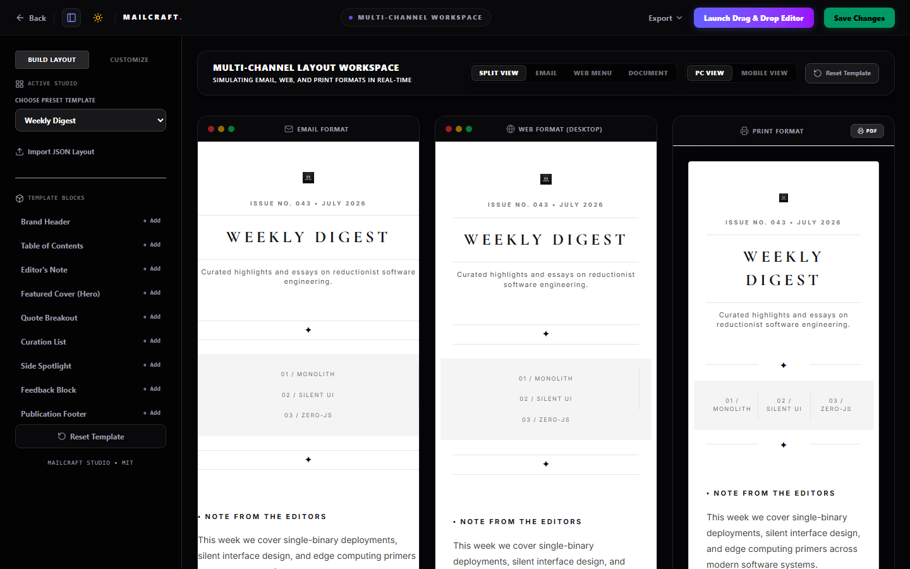

#### Light Mode Workspace
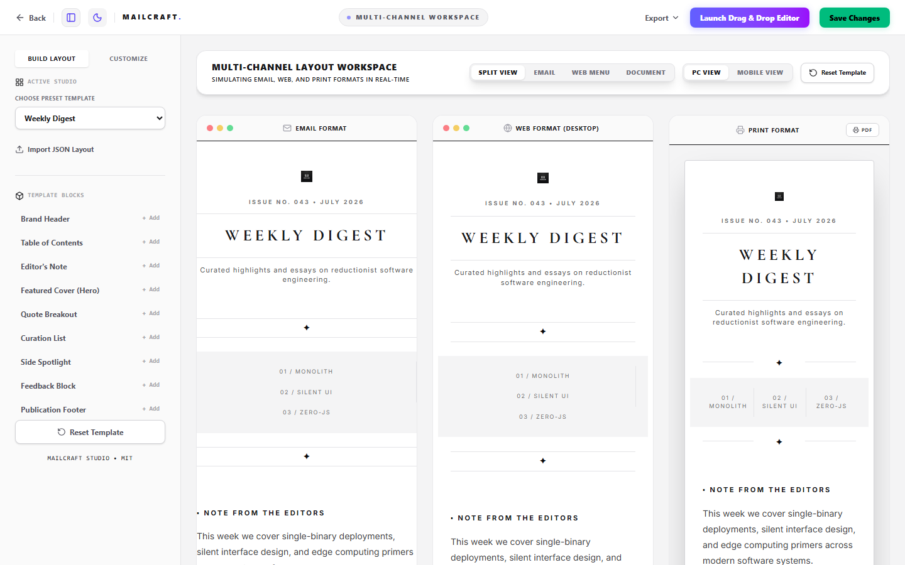

### 🎨 Unlayer Visual Builder Tab
Need customized structural revisions? Switch tabs to launch the fully featured **Drag & Drop Editor** powered by Unlayer, loaded with your active design configuration.

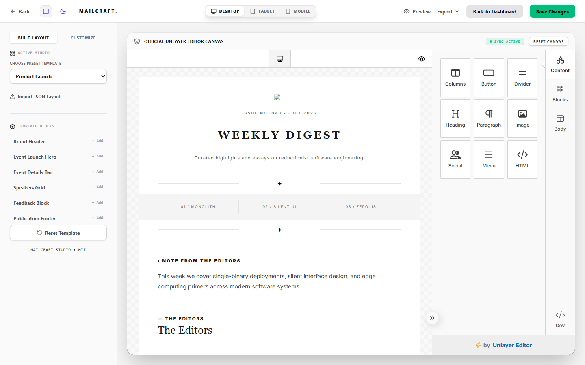

### 📤 Comprehensive Export Panel
* **Save Config JSON:** Download the structured customizer parameters to import later.
* **Save Editor JSON:** Download the Unlayer drag-and-drop schema layout.
* **Copy HTML outputs:** Instant copy-to-clipboard actions for compiled Email HTML and Print HTML.
* **Export High-Res PDF:** Launch standard system print dialogs with pre-loaded print stylesheet variables.
* **Capture PNG Images:** Trigger client-side canvas rendering to download visual snapshot graphics.

---

## 🚀 Getting Started

### 📋 Prerequisites
Make sure you have [Node.js](https://nodejs.org/) installed on your machine.

### 🔧 Installation
1. Clone the repository and navigate to the project directory:
   ```bash
   git clone https://github.com/nodeanurag/mailcraft.git
   cd mailcraft
   ```
2. Install package dependencies:
   ```bash
   npm install
   ```

### 💻 Local Development
1. Start the Vite local development server:
   ```bash
   npm run dev
   ```
2. Open [http://localhost:5173](http://localhost:5173) in your browser to access the studio.

### 📸 Auto-Generating Screenshots
If you modify templates or branding themes and wish to update the documentation screenshots automatically:
1. Make sure the local dev server is running (`npm run dev`).
2. Run the screenshot capture automation script:
   ```bash
   npm run screenshot
   ```
   *Note: This utilizes Playwright in headless mode to navigate the workspace, click presets, and export screenshots directly to `public/assets/`.*

### 🏗️ Production Build
Compile and bundle the project for production distribution:
```bash
npm run build
```
The compiled output will be generated inside the `dist/` directory.

---

## 🛡️ License
Distributed under the MIT License. See `LICENSE` for more information.
